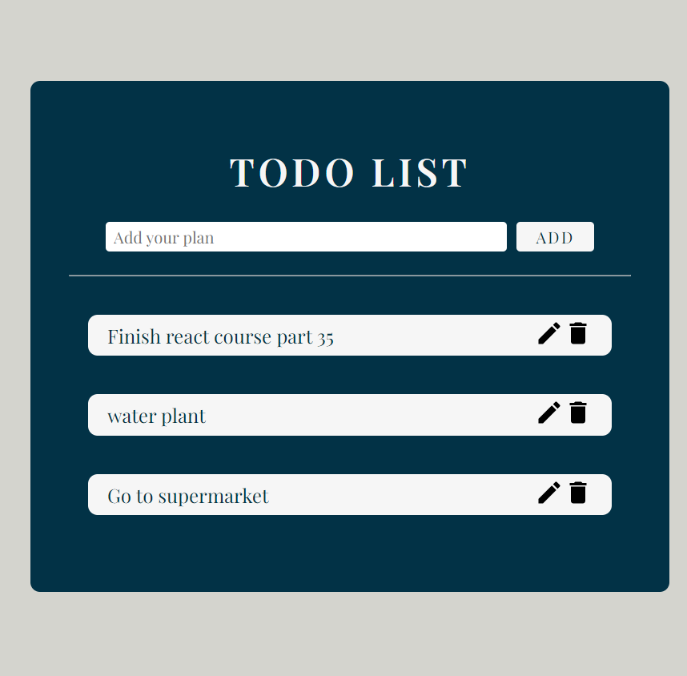

# Todo list

- Live Site URL: [live site here](https://ephemeral-nasturtium-5f722b.netlify.app/)

## Table of contents

- [Overview](#overview)
  - [The challenge](#the-challenge)
  - [Screenshot](#screenshot)
- [My process](#my-process)
  - [Built with](#built-with)
  - [Continued development](#continued-development)
  - [What I learn](#What-I-learn)
- [Author](#author)
- [Acknowledgments](#acknowledgments)

## Overview

### The challenge

Users should be able to:

- View the optimal layout for the site depending on their device's screen size
- See hover states for all interactive elements on the page
- Users are able to add, edit, and delete their plans by clicking the corresponding buttons.

### Screenshot

## My process

### Built with

- Semantic HTML5 markup
- CSS custom properties
- Flexbox
- Mobile-first workflow
- React

### Continued development

Use this section to outline areas that you want to continue focusing on in future projects. These could be concepts you're still not completely comfortable with or techniques you found useful that you want to refine and perfect.

### What I learn

- onSubmit={(e) => e.preventDefault()} :This is used to prevent a form from submitting and reloading the page, allowing us to handle the form submission using JavaScript instead.

- setItems(items.filter((current) => current.id !== item.id)) : This is a function that removes an item from an array of items based on its id property.

## Author

- Frontend Mentor - [@Tiff Lee](https://www.frontendmentor.io/profile/tifflee7784)
- Twitter - [@CodeTiffanyL](https://twitter.com/CodeTiffanyL)

## Acknowledgments

This is where you can give a hat tip to anyone who helped you out on this project. Perhaps you worked in a team or got some inspiration from someone else's solution. This is the perfect place to give them some credit.
